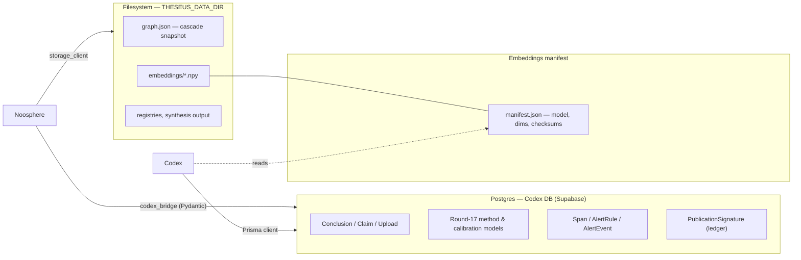
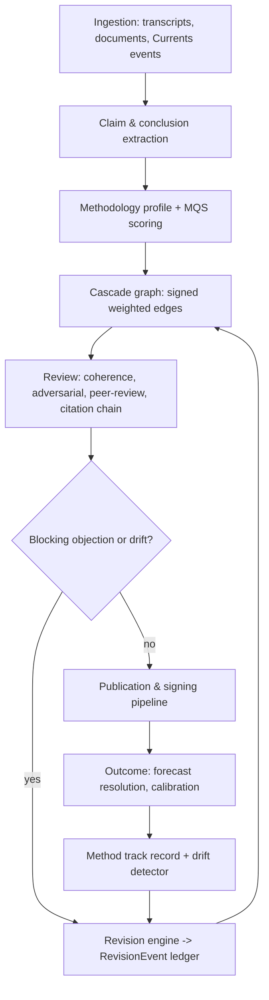
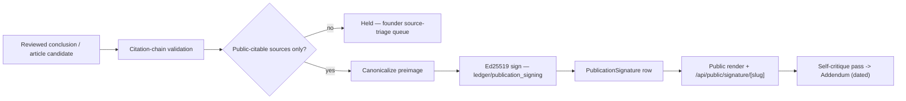

# Theseus Architecture

**Document version:** bound to git SHA `0034929` (2026-05-14).
**Status:** descriptive — this document records the system as it stands *after*
Round 17 (the methodology-implementation push) and Round 18 (the consolidation
and research-run pass). It is not a roadmap.

This is the connecting document for the eight scattered architecture notes the
firm accumulated through Round 17/18 — `Schema_Audit_Round18.md`,
`API_Envelope_Contract.md`, `Type_Boundaries.md`, `Noosphere_Module_Map.md`,
`Naming_Conventions.md`, `Configuration.md`, `Trace_Coverage.md`, and
`Mobile_Polish_Survey.md`. Each of those audits one slice of the system. This
file names how the slices fit together. It does **not** duplicate their prose:
every section ends with a "see also" pointing at the canonical source.

**Status markers** used throughout:

- **[production]** — has a module, a route or migration, a test, and an
  operational path.
- **[experimental]** — code and tests exist, but the surface is founder-only,
  partially instrumented, or still being calibrated.
- **[proposed]** — named in a companion doc as a target; not yet built.

---

## 1. System mission

Theseus is a research and investment firm building software for recorded,
inspectable reasoning. The durable object the system protects is not a
conclusion but a **reviewable record**: the source material, the claims pulled
from it, the method that produced each claim, the strongest objection, the
confidence, the revision condition, and — later — the outcome.

Three levels of work are kept distinct (see `THE_META_METHOD.md`):

1. **Object-level claims** — what the firm believes about a company, market,
   or event.
2. **Methods** — the reasoning procedures that produced those claims.
3. **Meta-methods** — criteria for judging whether a method is reliable in the
   domain where it was used.

Every architectural decision below serves one constraint: *reasoning only
compounds if a later reviewer can inspect the record.* The software is
instrumentation for that record — extraction, scoring, review, revision, and
publication are all in service of keeping the trail auditable after the
conversation, the publication, or the market event has passed.

The firm deliberately separates **working software** from **research
ambition**. Older research labels (Aletheia, the Dialectical Crucible, the
Calibration Engine, the Belief Revision System) map onto concrete subsystems
but are not finished products; this document marks each subsystem's real
status rather than its aspiration.

> **See also:** `README.md`, `METHODOLOGICAL_REORIENTATION.md`,
> `THE_META_METHOD.md`.

---

## 2. Top-level components and their boundaries

Theseus is three software surfaces over one shared database.

- **Noosphere** **[production]** — the Python processing engine. Ingests
  transcripts and writings, extracts claims and source structure, builds
  methodology profiles, scores them, computes embeddings, runs the
  coherence / adversarial / calibration tooling, drives the Currents and
  forecast pipelines, and writes back to the shared Codex database. Entry
  point: `python -m noosphere`. Internal layering is governed by an
  `import-linter` contract — see `Noosphere_Module_Map.md`.

- **Theseus Codex** **[production]** — the Next.js 16 / React 19 / Prisma 7
  web application. It is *both* the public site and the founder control
  plane. The public site shows reviewed articles, structured responses,
  forecasts, Currents opinions, and methodology pages; the founder workspace
  (the `authed` route group) handles uploads, review, publication, forecasts,
  and operations. Codex owns the database schema.

- **Dialectic** **[production]** — the PyQt6 desktop live-conversation
  analyzer. Narrower than Noosphere: it captures a discussion, transcribes it
  with `faster-whisper`, segments it into claims, shows argumentative signals
  live, and emits transcript/session artifacts into the Codex upload contract.
  Its output is an *input* to Noosphere, never a peer of it.

**Boundary rules.** Noosphere never queries Prisma directly; it reaches the
database through the `io` layer (`codex_bridge`) using generated Pydantic
models. Codex never imports Python; it calls Noosphere either through the
FastAPI services (`current_events_api`, `researcher_api`) or by reading rows
Noosphere has written. Dialectic talks only to the Codex upload/auth contract.
The contract that keeps the three honest at every wire crossing is JSON Schema
(`Type_Boundaries.md`) plus the unified API envelope (`API_Envelope_Contract.md`).

The full Noosphere package roster and the Codex route roster are in
**Appendix A**; the architectural layering of the Noosphere packages is the
subject of `Noosphere_Module_Map.md`.

> **See also:** `Noosphere_Module_Map.md`, `Type_Boundaries.md`,
> `API_Envelope_Contract.md`, `README.md`.

---

## 3. The data substrate

Theseus persists state in three places, each with a different durability and
ownership rule.

- **Postgres** is the system of record for everything relational: uploads,
  claims, conclusions, the ~25 Round-17 method/calibration/observability
  models, and the append-only ledger rows. The schema is owned by Prisma;
  `Schema_Audit_Round18.md` is the table-by-table inventory.
- **Filesystem** (`THESEUS_DATA_DIR`) holds what does not belong in a row: the
  cascade snapshot `graph.json`, embedding `.npy` arrays, method registries,
  and synthesis output. The `io` layer's `storage_client` abstracts local
  disk / MinIO / S3 / R2.
- **The embeddings manifest** (`manifest.json`) is the contract between the
  two: it records the embedding model, dimensionality, and per-file checksums
  so Codex can detect a stale or model-mismatched embedding set without
  loading the arrays.

**Persistence rules.** Mutable rows carry `createdAt` + `updatedAt`;
append-only ledger rows carry only `createdAt` — the *absence* of `updatedAt`
is the signal that a row is immutable (`RevisionEvent`, `CitationVerdict`,
`Span`, `SourceStanding`, `PublicationSignature`, `AttentionAction`). Every
tenant-scoped row carries `organizationId` with a `Restrict` delete policy;
observability tables are intentionally tenant-light. Migrations are
forward-only and idempotent. Backups (`noosphere backup`) bundle the SQLite
file, the full data directory, and the manifest together so a restore is
internally consistent.

> **See also:** `Schema_Audit_Round18.md`, `Configuration.md` (the
> `DATABASE_URL` / `THESEUS_DATA_DIR` knobs), `docs/operations/Migration_Runbook.md`.

---

## 4. The methodological substrate

This is the layer that distinguishes Theseus from a document store. It lives
mostly in the Noosphere `methods`, `evaluation`, `coherence`, `cascade`,
`inquiry`, and `temporal` packages.

- **Methods** **[production]** — every reasoning procedure is a registered
  package under `noosphere/methods/` carrying a `method.py`, a `RATIONALE.md`,
  and a `FAILURES.yaml`. The registry is a Python decorator catalog; method
  snapshots are content-addressed into the `MethodVersion` table.
- **MQS — Methodology Quality Score** **[production]** — the five working
  criteria from `THE_META_METHOD.md` (progressivity, severity, aim-method
  fit, compressibility, domain sensitivity) plus a composite, computed in
  `noosphere/evaluation/mqs.py` and persisted 1:1 against each `Conclusion`.
  The formal definition is `docs/methods/MQS_Specification.md`.
- **Criteria tooling** **[production / experimental]** — the aim-method-fit
  rubric and the severity rubric are production scoring paths; their ongoing
  *calibration* is tracked separately (`docs/methods/Aim_Method_Fit_Rubric.md`,
  `docs/methods/Severity_Calibration_Status.md`).
- **Cascade** **[production]** — `noosphere/cascade/` holds the firm's belief
  graph: truth-valued nodes (claims, conclusions, principles) joined by signed,
  weighted relation edges. `graph.py` is the aggregate; `traverse.py`,
  `diagnostics.py`, and `render.py` read it.
- **Revision** **[production]** — `cascade/revision.py` computes the blast
  radius of new evidence; every committed revision writes an immutable
  `RevisionEvent`, so replay-by-ledger can reconstruct any prior belief state.
- **Lineage** **[production]** — `noosphere/temporal/lineage.py` assembles the
  per-conclusion lineage (source → claim → method → objection → revision) and
  diffs two lineages; it is one of the few fully `@traced` modules.
- **Bayesian belief layer (BN)** **[experimental]** — a *derived view*, not a
  replacement for the cascade: `inquiry/bayesian_network.py` projects a cascade
  snapshot onto an acyclic Bayesian network for marginal probabilities and
  evidence updates. Founder-only, behind `/founder/`, rebuilt on demand, holds
  no state. Spec: `docs/methods/Bayesian_Belief_Layer.md`.
- **Cross-domain transfer** **[experimental]** — `noosphere/transfer/` packages
  a method for use in a new domain and runs a transfer-fitness study; the
  current output is the research study, not a production gate.

> **See also:** `docs/methods/MQS_Specification.md`,
> `docs/methods/Bayesian_Belief_Layer.md`,
> `docs/methods/Aim_Method_Fit_Rubric.md`,
> `docs/methods/Method_Retirement_Criteria.md`, `THE_META_METHOD.md`.

---

## 5. The reasoning workflow, end to end

1. **Ingestion** — uploads land via the Codex `upload` routes or are pulled
   from `CurrentEvent`; Noosphere's `io`/`extractors` packages extract text,
   and relevant-text filtering drops prompt/wrapper material so the real
   artifact is what gets analysed.
2. **Claim** — `methods/extract_claims.py` and friends produce claims and
   conclusions; `claim_extractor.py` and `classifier.py` type them.
3. **Methodology** — a methodology profile is generated and MQS-scored
   (section 4).
4. **Review** — the six-layer coherence engine, the multi-model adversarial
   swarm, peer review, and the citation-chain validator run against the
   conclusion. A blocking citation verdict or a drift event sends it back.
5. **Revision** — `cascade/revision.py` previews the blast radius; a committed
   revision writes a `RevisionEvent` and re-weights the cascade.
6. **Publication** — a conclusion that survives review enters the publication
   and signing pipeline (section 6).
7. **Outcome** — forecasts resolve, calibration is recomputed, the method
   track record is rolled up, and the drift detector watches for a method
   whose calibration has decayed — which re-enters the loop at revision.

The loop is deliberately a loop: an outcome is evidence, and evidence revises.

> **See also:** `Trace_Coverage.md` (which steps emit spans),
> `Schema_Audit_Round18.md` (the row each step writes),
> `METHODOLOGICAL_REORIENTATION.md`.

---

## 6. The publication and signing pipeline

Publication is gated, not automatic. **[production]**

- **Citation gating** — `literature/citation_chain.py` validates every cited
  excerpt against the stated claim with an NLI judge; a publication blocker or
  a private-only source holds the piece in the founder source-triage queue.
- **Canonicalization** — `ledger/canonicalize.py` builds a deterministic
  preimage. Renaming any field that participates in the preimage invalidates
  every historical signature — which is why such renames are an out-of-band
  review item in `Naming_Conventions.md`.
- **Signing** — `ledger/publication_signing.py` signs the preimage with an
  Ed25519 key (held outside the web tree — enforced by
  `scripts/check_signing_key_not_in_web.py`) and writes one immutable
  `PublicationSignature` per published revision.
- **Verification** — `ledger/verify.py` and `/api/public/signature/[slug]`
  let any reader re-derive and check the signature; CI re-checks signed
  artifacts with `scripts/check_signed_artifacts.py`.
- **Self-critique** — published articles are periodically re-reviewed; a
  finding becomes a dated `Addendum` block under the article rather than a
  silent edit.

Desktop application artifacts (Dialectic, the Noosphere CLI) are separately
code-signed and notarized — that is a distribution concern, covered by
`scripts/codesign_*` and the rolling-release workflow, not by this pipeline.

> **See also:** `Naming_Conventions.md` (signed-input rename policy),
> `Schema_Audit_Round18.md` (`PublicationSignature`, `Addendum`),
> `docs/security/Threat_Model.md`.

---

## 7. The observability and operations surfaces

- **Spans** **[production / instrumentation in progress]** — Round 17 added
  span-based observability via the `@traced` decorator
  (`noosphere/observability/`), writing `Span` rows with trace/parent IDs,
  timing, error kind, and cost. The decorator and schema are production; *only
  ~9% of public functions are wrapped today* — `Trace_Coverage.md` is the
  living gap list, regenerated by `scripts/survey_trace_coverage.py`.
- **Metrics and alerts** **[production]** — `MethodMetricRollup` aggregates
  per-method windows; `AlertRule` / `AlertEvent` hold threshold rules and
  their firings. These tables are tenant-light by design.
- **The attention queue** **[production]** — a unified founder queue; every
  snooze/dismiss is an append-only `AttentionAction`. Schema drift detected at
  a wire boundary (`Type_Boundaries.md`) surfaces here rather than throwing
  silently.
- **Configuration** **[production]** — all environment reads route through one
  typed module per language (`noosphere/core/config.py`,
  `theseus-codex/src/lib/config.ts`); `scripts/check_no_inline_env_reads.py`
  enforces it. Thresholds and magic numbers live in a central registry.
- **Operations** — health routes (`/api/health`), the production migration
  runbook, the forecast scheduler, and backup/restore are the operational
  surface. CI is a wall of consistency gates (schema audit, naming, import
  layering, signed artifacts, this document — section "CI consistency").

> **See also:** `Trace_Coverage.md`, `Configuration.md`,
> `docs/operations/Migration_Runbook.md`, `docs/operations/Forecasts_Scheduler.md`.

---

## 8. The public-facing surfaces and the visibility model

The Codex serves two audiences from one app, split by route group.

- **Founder workspace** (`authed`) — uploads, dashboard, library, transcripts,
  knowledge views, the embeddings explorer, founder Currents, publication
  review, forecasts, the attention queue, and ops. Behind bcryptjs auth.
- **Public site** — reviewed articles (`post`, `c`), structured responses,
  public Currents (`currents`), forecasts (`forecasts`), the methodology
  explorer (`methodology`), the calibration scorecard (`calibration`), the
  auto-generated research papers (`research`), critiques, revisions, and the
  syndication feeds (`atom.xml`, `feed.xml`).
- **API** (`api`) — every route returns the unified envelope; public routes
  are CORS-enabled and versioned.

**The visibility model.** The default is private. A conclusion, a source, or a
citation becomes public only by an explicit gate:

- Public article citations resolve **only** when the cited source is itself
  public; private citations stay visible to founders through the internal
  record, never through a public link.
- The Bayesian marginal, the raw cascade, raw transcripts, and hidden source
  documents are founder-only.
- Outside-reader replies and bounty critiques are **double-opt-in**: nothing a
  reader submits is published without an explicit founder confirmation step.

The public surfaces are also held to a mobile contract: every mobile/desktop
split ships both renderings in the HTML and lets a CSS media query choose, so
there is no post-hydration layout shift (`Mobile_Polish_Survey.md`).

The full Codex route roster is in **Appendix A**.

> **See also:** `Mobile_Polish_Survey.md`, `API_Envelope_Contract.md`,
> `Naming_Conventions.md` (URL conventions and 308 aliases),
> `METHODOLOGICAL_REORIENTATION.md` (the public/private intent).

---

## 9. Open questions about the architecture itself

These are unresolved at the architectural level — not bugs, but decisions the
firm has consciously deferred.

1. **The Noosphere layering is a target, not a fact.** `Noosphere_Module_Map.md`
   defines a hierarchical package layout enforced by `import-linter`, but the
   modules have not been physically relocated and the `DeprecationWarning`
   shims are **[proposed]**, not installed. Until then the layering is a
   contract over a flat directory.
2. **Where do `cascade`, `cases`, `decisions`, `principles`, `voices` live?**
   They are domain aggregates with no clear home in the core/methods/inquiry
   split — a `noosphere.domain/` layer is one option.
3. **Observability coverage.** At ~9% `@traced` coverage, the trace is not yet
   a reliable end-to-end picture of a request. Closing the gap is mechanical
   but unfinished.
4. **The polymorphic citation key.** `CitationVerdict.(citationKind, citationId)`
   is a weak reference spanning three citation tables; promoting it to a
   discriminated union is **[proposed]** and deferred until a fourth citation
   type appears.
5. **Two languages, one schema.** The JSON-Schema bridge keeps Pydantic and
   TypeScript aligned, but Prisma is still a third generator. There is no
   single source of truth for *all* shared types — only for the ones that
   cross a wire.
6. **The BN's relationship to the cascade.** The Bayesian layer is a derived
   view today; whether a future revision engine should consume BN marginals
   directly (rather than the cascade's noisy-OR algebra) is open.

> **See also:** `Noosphere_Module_Map.md` (§"Open questions for a future
> prompt"), `Schema_Audit_Round18.md` (§8 consolidation backlog),
> `Type_Boundaries.md` (§Non-goals), `Known_Cycles.md`, `Dead_Code_Survey.md`.

---

## Appendix A — Component index (CI-checked)

This index exists so `scripts/check_architecture_consistency.py` can confirm
the document still names every Noosphere package and every top-level Codex
route. It is a reference list, not architectural prose; the *meaning* of each
entry is in the sections above and in `Noosphere_Module_Map.md`.

**Noosphere packages** (`noosphere/noosphere/`)

- *Foundational:* `core`, `ledger`, `observability`, `_generated`
- *Methods & evaluation:* `methods`, `evaluation`, `inquiry`, `coherence`,
  `peer_review`, `mitigations`, `rigor_gate`, `cascade`, `inference`
- *Domain aggregates:* `cases`, `decisions`, `principles`, `voices`,
  `articles`, `distillation`
- *Temporal & lineage:* `temporal`
- *Literature & sources:* `literature`
- *Live & forecasting:* `currents`, `forecasts`, `social`, `decay`
- *I/O & extraction:* `io`, `extractors`, `embeddings`
- *Interop & transfer:* `interop`, `transfer`, `external_battery`
- *CLI, docs, benchmarks:* `cli`, `cli_commands`, `docgen`, `benchmarks`

**Codex routes** (`theseus-codex/src/app/`)

- *Public site:* `home`, `about`, `ask`, `c`, `calibration`, `critiques`,
  `currents`, `forecasts`, `methodology`, `post`, `privacy`, `proof`,
  `research`, `revisions`, `login`, `atom.xml`, `feed.xml`
- *Founder workspace:* `authed`
- *API:* `api`

---

## Changelog

Each substantive change writes a new entry here, tagged with the git SHA at
which it landed. The document version at the top of the file tracks the most
recent entry.

| Date | Git SHA | Change |
|------|---------|--------|
| 2026-05-14 | `0034929` | Initial architecture document. Connects the eight Round 17/18 scattered docs; describes the three components, the data and methodological substrates, the end-to-end reasoning workflow, the publication/signing pipeline, the observability and public surfaces, and the open architectural questions. Adds the CI-checked component index (Appendix A). |
